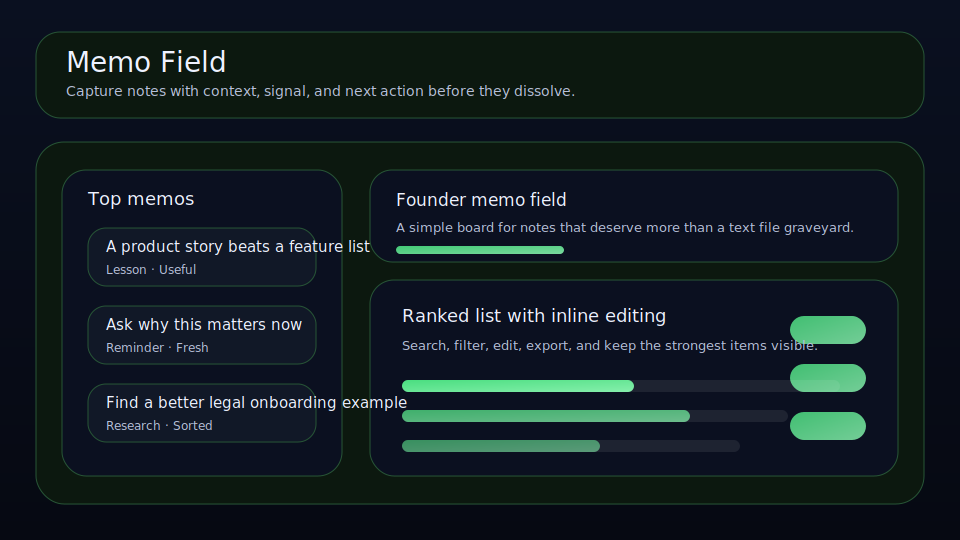

# Memo Field

Capture notes with context, signal, and next action before they dissolve.



Memo Field is a local-first workspace for founders, operators, and solo builders who want a cleaner way to manage memos. It keeps recall value, context, next action, and review timing visible so the right things move forward with less drift.

## What it does

- ranks memos by leverage, recall value, timing, and friction
- tracks **context**, **next action**, **review date**, and **recall value** for each memo
- highlights the best current bet, the next review slot, and the strongest signal on the board
- renders a dedicated queue plus a category mix snapshot beneath the main board
- saves locally in the browser with JSON import/export backups
- quick action: **Link note**
- quick action: **Raise recall value**
- quick action: **Mark actioned**

## Why it feels different

Memo Field is not just a generic list. It is shaped around the real workflow behind memos, so the board helps you decide what matters next instead of simply storing records.

## Quick start

```bash
git clone https://github.com/get2salam/memo-field.git
cd memo-field
python -m http.server 8000
```

Then open <http://localhost:8000>.

## Keyboard shortcuts

- `N` creates a new memo
- `/` focuses the search box

## Verify locally

The scoring helpers behind the priority ranking live in `js/scoring.js` and are covered by a small `node:test` suite. No dependencies required — Node 18+ ships everything needed:

```bash
npm run verify
```

`npm run verify` first checks that the static assets referenced from `index.html` exist, confirms the package scripts and GitHub Actions workflow still point at the same local verification contract, then runs the scoring regression suite. Use `npm test` when you only want the Node test suite.

The suite pins a fake "today" so the due-date boost is deterministic and exercises the score, recall value, friction, due-date, completed-state, and unknown-state branches of `priority()`.

For agent/evaluation integrations, `priorityBreakdown()` returns the exact score components (`scoreImpact`, `recallImpact`, `dueBoost`, `stateImpact`, and `frictionImpact`) plus `completed`/`overdue` flags. That makes memo ranking auditable without reimplementing the browser scoring rules.

## Privacy

Everything stays in your browser unless you export a JSON backup.

## License

MIT
